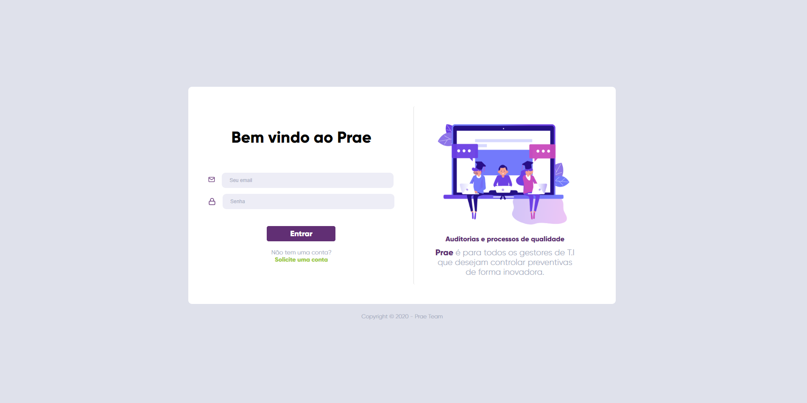
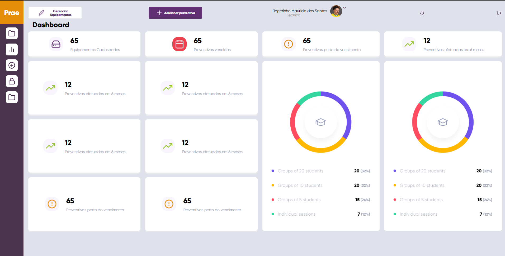
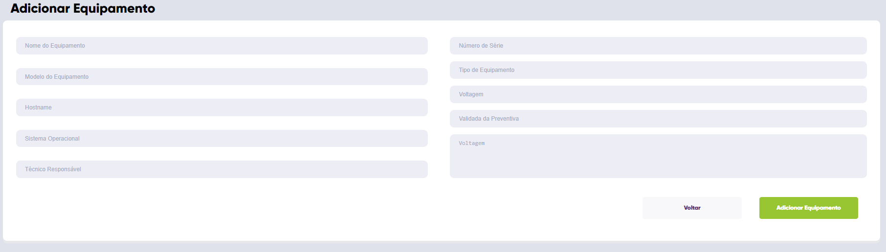
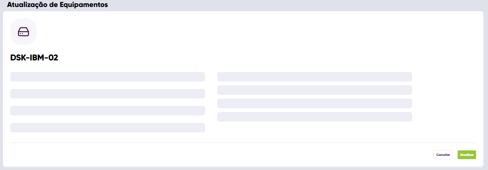
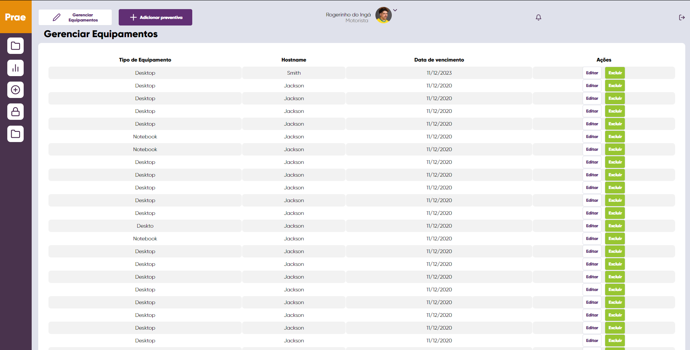
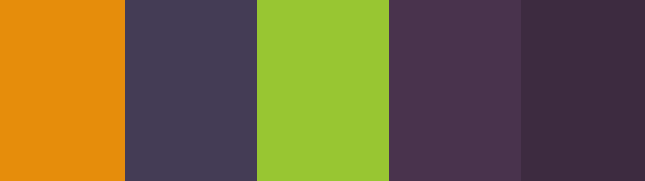

# Prae - Preventivas Corporativas

Prae é uma  aplicação conceito de preventivas corporativas, realizei algumas telas em React, sendo minha primeira empreitada na tecnologia.

Este código (Frontend) está sendo liberado caso alguém queira aproveitar essas telas na qual desevolvi para estudo voltada para uma  aplicação real.

# Tela de login:

Simples tela de login personalizada.




# Tela Dashboard

Tela Dashboard para controlar as estatisticas dos técnicos e projetar metas.



# Adicionar equipamentos

Tela simples para adição de equipamentos para serem monitorados.



# Atualização de equipamentos

Tela para atualização de equipamento.



# Tela de listagem

Tela para listagem completa de equipamentos




## Instalação

Siga as instruções caso queira a versão em código em seu navegador.

Navegue no terminal até a pasta onde você clonou o repositório e digite no console:

```
npm install 
```

Depois que as depedencias forem baixadas:

```
npm start 
```
## Rotas


A página principal da aplicação após execução é Logon. Não implementei as rotas do React, pois não teria aproveitamento desse código para alguém caso queira reaproveitar o JSX. Em <b> src/App.js</b> apenas retire os comentários. 


(Retire os comentários de apenas uma página por vez)
```
function App() {
  return (
    <Logon/>
    //<Dashboard/>
    //<EditEquipament/>
     //<ListEquipament/>
    //<AddEquipament/>
  );
}
```


## Dependencias usadas:

* [React](https://github.com/facebook/react) - Framework
* [Feather Icons](https://github.com/feathericons/feather) - Icones
* [Figma](https://www.figma.com/files/recent) - Ferramenta de Design
 Usei paleta de cores da Nubank.
 
 
 ## Curiosidade:
 
 Foi usada a paleta de cores da Nubank :)
 


 ## Atenção!
 
 Interfaces e código desevolvidos para estudo, poderá ocorrer bugs ou problemas.


## Autor

Vitor Vigarani

## License

Projeto licenciado sobre MIT License -  [LICENSE.md](LICENSE.md)

## Agradecimentos

* A Rocketeseat pela semana Oministack na qual adquiri alguns conhecimentos basicos de React.

